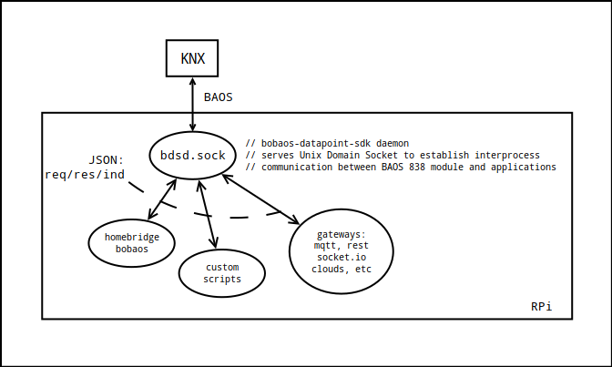

# bdsd - baos datapoint sdk daemon

This module intended to solve architecturing problem when developing js applcation for KNX.
Nodejs connects to BAOS 838 module via serial port, usually /dev/ttyAMA0 and it handles only one connection at a time.
But what if you want to connect to KNX bus multiple clients? 
If you want to write some custom scripts and use this device as a MQTT gateway at a same time?

So, schematically it may look like this:



# Installation

Assuming you have Raspberry Pi with installed Raspbian with configured access to BAOS module via /dev/ttyAMA0.

1. Clone repository to home folder, install dependencies.

```bash
$ cd ~/
$ git clone https://github.com/shabunin/bdsd.sock
$ cd ~/bdsd.sock/
$ npm install
```

2. Create systemd service folders, copy service file

```bash
$ cd ~/
$ mkdir ~/.config/systemd
$ mkdir ~/.config/systemd/user
$ cp ~/bdsd.sock/bdsd.service ~/.config/systemd/user
```

3. Enable service, enable automatic start-up

```bash
$ systemctl --user daemon-reload
$ systemctl --user enable bdsd.sock
$ sudo loginctl enable-linger pi
```

# Usage in js

For js applications there will be available client-side library which you may install from npm.

Further information you can find in repo: [bdsd.client](https://github.com/shabunin/bdsd.client)

# Usage with other programming languages

For other programming languages you may implement client-side library which should communicate with IPC following [Bobaos Datapoint Sdk Message Protocol](./PROTOCOL.md).
